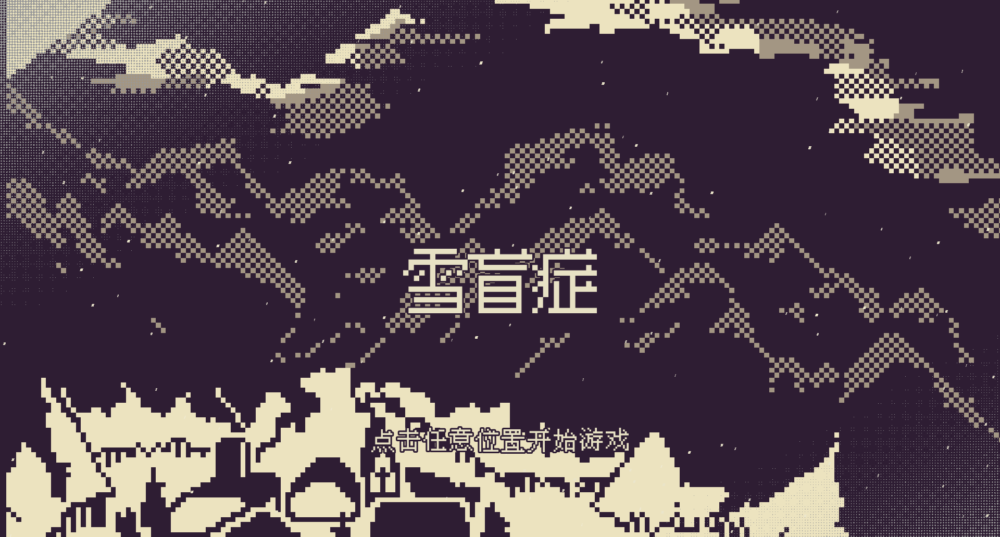

# 雪盲症

## 开发成员
* **Sombrua**  文案 & 策划
* **21**  文案
* **Algernon** 美术
* **迥苍** 美术
* **山茫** 音效
* **MaoT** 程序 & 策划

## 使用方法
* 拉取项目后，使用Godot4.4dev7 mono（注意是mono版）引擎导入项目目录。
* 通过引擎开启项目后，你可能（其实是必然）会遇到一个资源缺失的报错，不用担心这是正常现象，叉掉他并点击引擎右上角的构建按钮（或者Alt+B）
* 等待引擎构建完成后，再通过左上角的菜单进入项目设置（项目-项目设置），弹出窗口后通过页签打开插件界面，勾选第一项的启用后，你就可以构建和运行游戏了。

## 使用资源
* 引擎： [Godot4.4 dev7](https://godotengine.org/)
* 字体： [汉字库像素字体 / HZK Pixel Font](https://github.com/TakWolf-Deprecated/hzk-pixel-font)
* 脚本语言： [Yarnspinner](https://www.yarnspinner.dev/)
